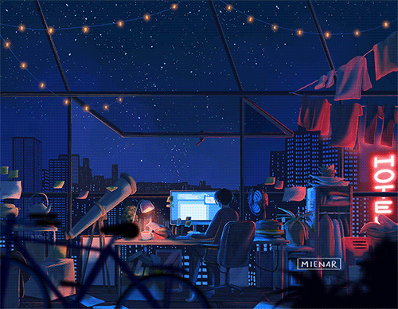

    <i>Onde código, criatividade e speedcubing se encontram em perfeita harmonia</i>

    
    

<h2 align="center">Desenvolvedor Front-End em construção, Speedcuber apaixonado e Eterno Aprendiz 🚀</h2>

<h3>🌱 Minha Jornada de Desenvolvimento</h3>

Sou um desenvolvedor em constante evolução, unindo a precisão do speedcubing com a arte da programação. Cada algoritmo que aprendo no cubo mágico me ensina algo sobre a elegância do código limpo.

#### 🎯 Atualmente
- Aprofundando conhecimentos em **JavaScript** e suas nuances
    - Desenvolvendo interfaces modernas e responsivas
    - Aplicando princípios de speedcubing na resolução de problemas de código
    - Construindo uma base sólida em desenvolvimento Front-End

    #### 🌟 Objetivos 2025
    - Contribuir ativamente com projetos open source
    - Desenvolver soluções que impactem positivamente a comunidade
    - Expandir meu domínio técnico para novas tecnologias
    - Compartilhar conhecimento através de projetos práticos

    #### 💡 Paixões & Interesses
    - Desenvolvimento criativo que desafia limites
    - Literatura técnica e crescimento pessoal
    - Speedcubing como arte e ciência
    - Tecnologias que transformam o futuro

    

        
    

    
<h3>🛠️ Arsenal Tecnológico</h3>

        <h3>Tecnologias que Domino com Paixão</h3>
        
        
<i>Ferramentas que uso diariamente para dar vida às minhas ideias</i>

<h3>Próximas Conquistas Tecnológicas</h3>
        
        
<i>Tecnologias que em breve farão parte do meu arsenal</i>

    

        
    

    
<h3>📊 Minha Jornada em Números</h3>

        <h3>Conquistas no GitHub</h3>

        
<i>Cada troféu representa uma etapa importante na minha jornada de desenvolvimento</i>

<h3>Linguagens Mais Utilizadas</h3>
        
        
<i>As ferramentas que mais utilizo para criar soluções</i>

<h3> Estatísticas e Contribuições </h3>
        
        

    

    
<h3>📈 Atividade no GitHub</h3>

        
    

<h3>🤝 Vamos Construir Algo Incrível Juntos?</h3>
    

    <i>Estou sempre aberto a novas conexões, ideias e projetos interessantes!</i>
    

         &nbsp;&nbsp;
        

    

